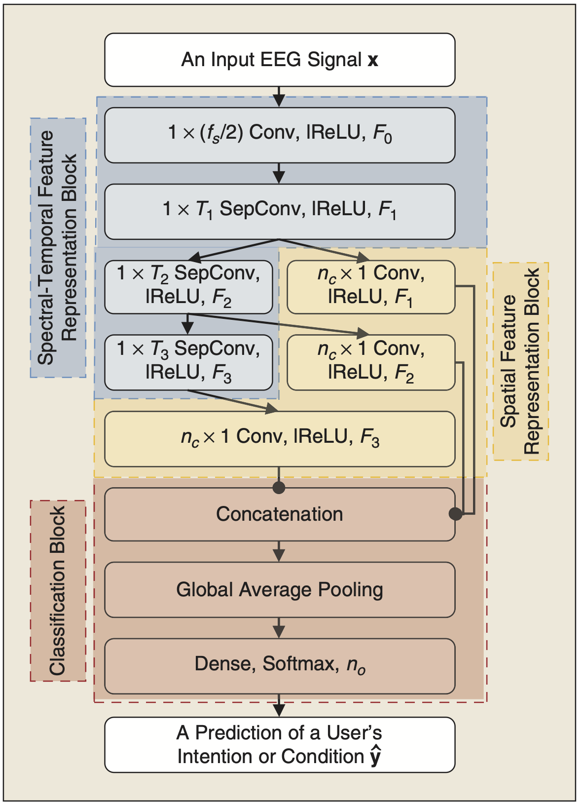

## Multi-Scale Neural Network for EEG Representation Learning in BCI
<p align="center"></p>

This repository provides a TensorFlow implementation of the following paper:
> **Multi-Scale Neural Network for EEG Representation Learning in BCI**<br>
> [Wonjun Ko](https://scholar.google.com/citations?user=Fvzg1_sAAAAJ&hl=ko&oi=ao)<sup>1</sup>, [Eunjin Jeon](https://scholar.google.com/citations?user=U_hg5B0AAAAJ&hl=ko)<sup>1</sup>, Seungwoo Jeong<sup>2</sup>, and [Heung-Il Suk](https://scholar.google.co.kr/citations?user=dl_oZLwAAAAJ&hl=ko)<sup>1, 2</sup><br/>
> (<sup>1</sup>Department of Brain and Cognitive Engineering, Korea University) <br/>
> (<sup>2</sup>Department of Artificial Intelligence, Korea University) <br/>
> Official Version: https://ieeexplore.ieee.org/abstract/document/9403717 <br/>
> Published in IEEE Computaional Intelligence Magazine (2020-JCR-IF: 11.356, Computer Science-Aritificial Intelligence: 7/140)
> 
> **Abstract:** *Recent advances in deep learning have had a methodological and practical impact on brain–computer interface (BCI) research. Among the various deep network architectures, convolutional neural networks (CNNs) have been well suited for spatio-spectral-temporal electroencephalogram (EEG) signal representation learning. Most of the existing CNN-based methods described in the literature extract features at a sequential level of abstraction with repetitive nonlinear operations and involve densely connected layers for classification. However, studies in neurophysiology have revealed that EEG signals carry information in different ranges of frequency components. To better reflect these multi-frequency properties in EEGs, we propose a novel deep multi-scale neural network that discovers feature representations in multiple frequency/time ranges and extracts relationships among electrodes, i.e., spatial representations, for subject intention/condition identification. Furthermore, by completely representing EEG signals with spatio-spectral-temporal information, the proposed method can be utilized for diverse paradigms in both active and passive BCIs, contrary to existing methods that are primarily focused on single-paradigm BCIs. To demonstrate the validity of our proposed method, we conducted experiments on various paradigms of active/passive BCI datasets. Our experimental results demonstrated that the proposed method achieved performance improvements when judged against comparable state-of-the-art methods. Additionally, we analyzed the proposed method using different techniques, such as PSD curves and relevance score inspection to validate the multi-scale EEG signal information capturing ability, activation pattern maps for investigating the learned spatial filters, and t-SNE plotting for visualizing repre- sented features. Finally, we also demonstrated our method’s application to real-world problems. Based on our experimental results and analyses, we believe that the proposed multi-scale neural network can be useful for various BCI paradigms, as a starting model or as a backbone network in any new BCI experiments.*

## Dependencies
* [Python 3.6+](https://www.continuum.io/downloads)
* [TensorFlow 2.0.0+](https://www.tensorflow.org/)

## Downloading datasets
To download GIST-MI dataset
* http://gigadb.org/dataset/100295

To download KU-MI/SSVEP dataset
* http://gigadb.org/dataset/100542

To download SEED-VIG dataset
* https://bcmi.sjtu.edu.cn/~seed/seed-vig.html

To download CHB-MIT dataset
* https://physionet.org/content/chbmit/1.0.0/

To download CHB-MIT dataset
* https://physionet.org/content/chbmit/1.0.0/

## Citation
If you find this work useful for your research, please cite our [paper](https://ieeexplore.ieee.org/abstract/document/9403717):
```
@article{ko2021multi,
  title={Multi-scale neural network for EEG representation learning in BCI},
  author={Ko, Wonjun and Jeon, Eunjin and Jeong, Seungwoo and Suk, Heung-Il},
  journal={IEEE Computational Intelligence Magazine},
  volume={16},
  number={2},
  pages={31--45},
  year={2021},
  publisher={IEEE}
}
```

## Acknowledgements
This work was supported by Institute for Information & Communications Technology Promotion (IITP) grant funded by the Korea government under Grant 2017-0-00451 (Development of BCI based Brain and Cognitive Computing Technology for Recognizing User’s Intentions using Deep Learning) and Grant 2019-0-00079 (Department of Artificial Intelligence, Korea University).
